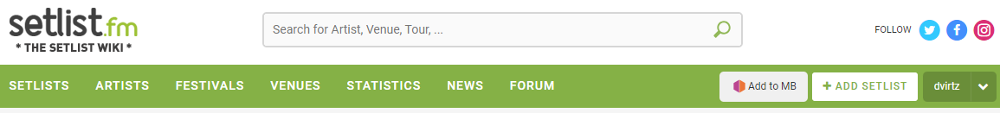

# MusicBrainz Scripts

This repository contains a collection of user scripts for [MusicBrainz](https://musicbrainz.org). 

## Installation

To install a user script from this repository, follow your user script manager's instructions. 

See https://musicbrainz.org/doc/Guides/Userscripts#Userscript_manager for more information.

## Scripts

### setlist.fm event importer &nbsp; 

This scripts allows you to import set lists from [setlist.fm](https://setlist.fm) as MusicBrainz events.

When viewing a set list on setlist.fm, a new "Add to MB" button will appear on the page.
Clicking the button will open a MusicBrainz create event window with the event form pre-filled with the set list data.

## Contributing

Pull requests are well come.

## License

This project is licensed under the MIT License. See the [LICENSE](LICENSE) file for more information.
