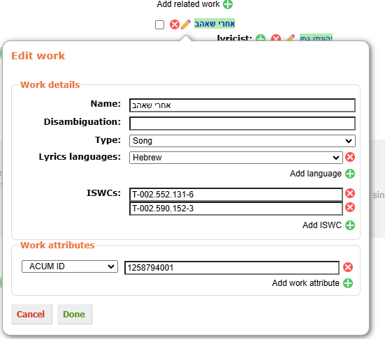

# ACUM work importer

[![install](https://img.shields.io/badge/install-latest-3c9a40?style=for-the-badge&logo=data%3Aimage%2Fsvg%2Bxml%3Bbase64%2CPHN2ZyB4bWxucz0iaHR0cDovL3d3dy53My5vcmcvMjAwMC9zdmciIHhtbG5zOnhsaW5rPSJodHRwOi8vd3d3LnczLm9yZy8xOTk5L3hsaW5rIiB2ZXJzaW9uPSIxLjEiIGlkPSJDYXBhXzEiIHg9IjBweCIgeT0iMHB4IiB2aWV3Qm94PSIwIDAgMjkuOTc4IDI5Ljk3OCIgc3R5bGU9ImN1cnNvcjogZGVmYXVsdDsiIHhtbDpzcGFjZT0icHJlc2VydmUiPiA8Zz4gPHBhdGggc3R5bGU9ImZpbGw6IzNDOUE0MDsiIGQ9Ik0yNS40NjIsMTkuMTA1djYuODQ4SDQuNTE1di02Ljg0OEgwLjQ4OXY4Ljg2MWMwLDEuMTExLDAuOSwyLjAxMiwyLjAxNiwyLjAxMmgyNC45NjdjMS4xMTUsMCwyLjAxNi0wLjksMi4wMTYtMi4wMTIgICB2LTguODYxSDI1LjQ2MnoiLz4gPHBhdGggc3R5bGU9ImZpbGw6IzNDOUE0MDsiIGQ9Ik0xNC42MiwxOC40MjZsLTUuNzY0LTYuOTY1YzAsMC0wLjg3Ny0wLjgyOCwwLjA3NC0wLjgyOHMzLjI0OCwwLDMuMjQ4LDBzMC0wLjU1NywwLTEuNDE2YzAtMi40NDksMC02LjkwNiwwLTguNzIzICAgYzAsMC0wLjEyOS0wLjQ5NCwwLjYxNS0wLjQ5NGMwLjc1LDAsNC4wMzUsMCw0LjU3MiwwYzAuNTM2LDAsMC41MjQsMC40MTYsMC41MjQsMC40MTZjMCwxLjc2MiwwLDYuMzczLDAsOC43NDIgICBjMCwwLjc2OCwwLDEuMjY2LDAsMS4yNjZzMS44NDIsMCwyLjk5OCwwYzEuMTU0LDAsMC4yODUsMC44NjcsMC4yODUsMC44NjdzLTQuOTA0LDYuNTEtNS41ODgsNy4xOTMgICBDMTUuMDkyLDE4Ljk3OSwxNC42MiwxOC40MjYsMTQuNjIsMTguNDI2eiIvPiA8Zz4gPC9nPiA8Zz4gPC9nPiA8Zz4gPC9nPiA8Zz4gPC9nPiA8Zz4gPC9nPiA8Zz4gPC9nPiA8Zz4gPC9nPiA8Zz4gPC9nPiA8Zz4gPC9nPiA8Zz4gPC9nPiA8Zz4gPC9nPiA8Zz4gPC9nPiA8Zz4gPC9nPiA8Zz4gPC9nPiA8Zz4gPC9nPiA8L2c%2BIDxnPiA8L2c%2BIDxnPiA8L2c%2BIDxnPiA8L2c%2BIDxnPiA8L2c%2BIDxnPiA8L2c%2BIDxnPiA8L2c%2BIDxnPiA8L2c%2BIDxnPiA8L2c%2BIDxnPiA8L2c%2BIDxnPiA8L2c%2BIDxnPiA8L2c%2BIDxnPiA8L2c%2BIDxnPiA8L2c%2BIDxnPiA8L2c%2BIDxnPiA8L2c%2BIDwvc3ZnPg%3D%3D&labelColor=lightyellow)](https://github.com/dvirtz/musicbrainz-scripts/releases/latest/download/acum-work-import.user.js)
[![source](https://img.shields.io/badge/source-lightyellow?style=for-the-badge&logo=data%3Aimage%2Fsvg%2Bxml%3Bbase64%2CPHN2ZyB4bWxucz0iaHR0cDovL3d3dy53My5vcmcvMjAwMC9zdmciIHhtbG5zOnhsaW5rPSJodHRwOi8vd3d3LnczLm9yZy8xOTk5L3hsaW5rIiB2ZXJzaW9uPSIxLjEiIHg9IjBweCIgeT0iMHB4IiB2aWV3Qm94PSIwIDAgMTAwIDEwMCIgZW5hYmxlLWJhY2tncm91bmQ9Im5ldyAwIDAgMTAwIDEwMCIgeG1sOnNwYWNlPSJwcmVzZXJ2ZSIgc3R5bGU9ImN1cnNvcjogZGVmYXVsdDsiPjxwYXRoIHN0eWxlPSJmaWxsOiMzODM4OEE7IiBkPSJNMi4zNDMsNTQuMUMwLjkzOCw1My4xNjIsMCw1MS4yODksMCw0OS42NDhjMC0xLjY0LDAuNzAzLTMuMTYyLDIuNDYtMy45ODJIMi4zNDNjOC4zMTctNC45MiwxOS45MTUtMTEuNDgsMjcuNjQ3LTE2LjA0OSAgdjEwLjg5NWMtMy4wNDYsMS43NTctNy4xNDYsMy43NDktMTcuNDU1LDkuMjU1bDAuMTE3LDAuMTE2YzUuNTA2LDIuNDYxLDExLjgzMiw2LjIwOSwxNy4zMzgsOS40ODl2MTEuMDEyTDIuMzQzLDU0LjF6Ii8%2BPHBhdGggc3R5bGU9ImZpbGw6IzM4Mzg4QTsiIGQ9Ik05Ny42NTcsNDUuOWMxLjQwNCwwLjkzOCwyLjM0MywyLjgxMiwyLjM0Myw0LjQ1MmMwLDEuNjQtMC43MDMsMy4xNjItMi40NjEsMy45ODJoMC4xMTggIGMtOC4zMTcsNC45Mi0xOS45MTYsMTEuNDgtMjcuNjQ3LDE2LjA0OVY1OS40ODhjMy4wNDYtMS43NTYsNy4xNDYtMy43NDgsMTcuNDU1LTkuMjU0bC0wLjExNy0wLjExNiAgYy01LjUwNS0yLjQ2MS0xMS44MzItNi4yMDktMTcuMzM4LTkuNDg5VjI5LjYxN0w5Ny42NTcsNDUuOXoiLz48cGF0aCBzdHlsZT0iZmlsbDojMzgzODhBOyIgZD0iTTQ2LjQwMSw3MS44NDRIMzkuMzlMNTMuNDgsMjguMTU2aDcuMTNMNDYuNDAxLDcxLjg0NHoiLz48L3N2Zz4%3D)](src/index.ts)

This scripts allows you to import works from the database of the Israeli rights management society [ACUM](https://acum.org.il/en).

To import a whole medium:

1. Open the release relationship editor.
2. Find the album ID, this will be in the end of the album URL in ACUM, e.g. <https://nocs.acum.org.il/acumsitesearchdb/album?albumid=011820>.
3. Insert the ACUM url or album ID in the input box.
4. Select the recordings whose works you want to import.
5. Click the import button.
6. New works (green background links) will be created and existing works (yellow background) will be updated with links to the selected recordings and any writer and arranger as well as ISWCs and ACUM ID work attribute.
   
7. Review the changes by opening the edit dialogs before submitting the changes.
   
8. When ready, submit the works by clicking the "Submit Works" button or "Cancel" to skip ISWCs and work attribute submission.
9. Submit the rest of the relationships as usual.

Since ACUM database treats every medium as a separate album all selected recordings should be under a single medium.

To import a single work:

1. Open a work editor or select a single work in a release editor.
2. Find the work ID, this will be in the end of the work URL in ACUM, e.g. <https://nocs.acum.org.il/acumsitesearchdb/work?workid=1005566>.
3. Insert the ACUM url or work ID in the input box.
4. Click the import button.
5. The work will be updated with links writers, ISWCs and ACUM ID work attribute.
6. Review the changes.
7. Submit the work.

The script will search for existing works with the same ISWC or ACUM ID work attribute and use them if found. This can slow down the import process and can be disabled in the settings.

## Settings

Settings can be changed through the script manager menu.

| Setting | Description | Default |
| --- | --- | --- |
| `Search for existing works` | Tries to detect if works already exist in MB and use them | `true` |
| `Set language` | Get language from ACUM, which can sometimes be inaccurate | `true` |

## Release Notes

See [CHANGELOG.md](CHANGELOG.md).
