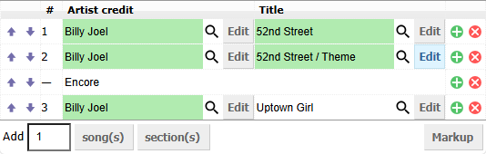
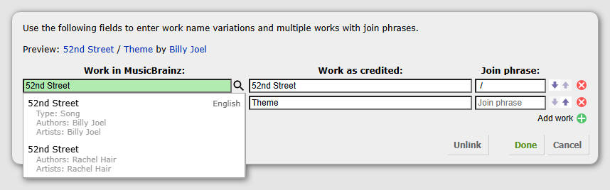

# Event Setlist Editor

[![install][badge-install]](https://github.com/dvirtz/musicbrainz-scripts/releases/latest/download/event-setlist-editor.user.js) [![beta][badge-beta]](https://github.com/dvirtz/musicbrainz-scripts/releases/download/beta-latest/event-setlist-editor.user.js) [![source][badge-source]](src/index.ts)

Edit MusicBrainz event setlists in a tracklist-style table on event creation and editing pages, including the beta and test sites.

## Usage

1. Open **Add event** or an existing event's **Edit** page. The editor appears inside **Event details**, at the setlist field, with artist credits before titles.
2. Choose the number beside **Add**, then click **song(s)**. To paste a setlist, switch to **Markup** and edit the text directly.
3. Enter titles and artist credits. Use **Search** with a name, MBID, or MusicBrainz artist/work URL, then select a result to link it. Text can also remain unlinked.
4. Click **Edit** beside a title or artist credit to open its dialog. Use **Add artist credit** for multiple credits and **Add work** for medleys, with join phrases such as ` with ` or ` / `, including spaces. **Done** applies the changes; **Cancel** discards them. Editing the credited name in the dialog preserves its link; **Unlink** removes all links in that dialog while retaining the credited text.
5. Click the green plus beside a song to enter additional info in a popup, one note per line. Use **section(s)** for Encore, Interlude, or other standalone information and edit its text directly in the row. Its plus also opens a popup for longer text. **Done** applies popup changes; **Cancel** or Escape discards them. Move rows with the arrows in the left column; delete them with the cross on the right.
6. Submit the event with MusicBrainz's normal controls after completing the remaining event fields.

New songs copy the previous effective artist credit independently. A blank song credit inherits the preceding artist. The first song starts without an artist. Pressing Enter in a lookup field runs its search unless a result is highlighted, in which case it selects that result.

Multiple works or artist credits are shown as a combined summary in the table. Their **Edit** dialog uses MusicBrainz's artist-credit bubble styling, with separate lookup, credited-name, and join-phrase columns. Changing a credited name preserves the selected entity. Use the arrows to reorder entities and the cross to remove one. Search uses the magnifying-glass button, including inside the dialog.

Resolved links use MusicBrainz's green input styling. Typing in a table title or artist field clears its link. Combined summaries have a disabled search button; use their Edit dialog to change the entities. Click the magnifying-glass button again to close open results, or press Escape in the lookup field. Search results support arrow-key navigation and Enter to select. Escape closes an open dialog once the lookup results are closed.

Work results show the primary alias, disambiguation, languages, type, authors, and recording artists when available, matching MusicBrainz's work lookup. Languages appear to the right of the title. These details appear in both the table and the work editor dialog, where results can extend beyond the dialog. Selecting a result adds its title and link to the setlist; an independently edited credited name in the dialog is retained. Search metadata is not included in the setlist.

## Markup and existing setlists

The original setlist textarea remains the submitted field and updates immediately after table edits. **Markup** shows that textarea for direct editing; **Table** reads its current value again. Changes from other userscripts that dispatch input or change events are incorporated immediately. Direct value assignments are read when returning to Table mode or making the next table edit.

Existing markup is preserved exactly until edited. Artist declarations set the credit for subsequent songs until the next declaration, without adding a table row. Information immediately after a song becomes its additional info. Information after a blank line starts a standalone info row; consecutive information lines share that row. Blank lines do not add table rows.

Medleys with several work links appear as multiple editable works with their original join phrases. Expressions with unlinked text before a link that cannot be split reliably, and unfamiliar lines, remain labelled **Malformed markup** rows. Edit those entries in Markup mode. Blank lines are retained. Literal brackets and ampersands are escaped when generating markup.

Searches use the current MusicBrainz host and its shared request rate limit. A failed search retains the entered text and can be retried. Linking a work or artist adds only a setlist link; it does not create entities or relationships.

## Release Notes

See [CHANGELOG.md](CHANGELOG.md).

[badge-install]: https://img.shields.io/badge/install-latest-3c9a40?style=for-the-badge&logo=data%3Aimage%2Fsvg%2Bxml%3Bbase64%2CPHN2ZyB4bWxucz0iaHR0cDovL3d3dy53My5vcmcvMjAwMC9zdmciIHhtbG5zOnhsaW5rPSJodHRwOi8vd3d3LnczLm9yZy8xOTk5L3hsaW5rIiB2ZXJzaW9uPSIxLjEiIGlkPSJDYXBhXzEiIHg9IjBweCIgeT0iMHB4IiB2aWV3Qm94PSIwIDAgMjkuOTc4IDI5Ljk3OCIgc3R5bGU9ImN1cnNvcjogZGVmYXVsdDsiIHhtbDpzcGFjZT0icHJlc2VydmUiPiA8Zz4gPHBhdGggc3R5bGU9ImZpbGw6IzNDOUE0MDsiIGQ9Ik0yNS40NjIsMTkuMTA1djYuODQ4SDQuNTE1di02Ljg0OEgwLjQ4OXY4Ljg2MWMwLDEuMTExLDAuOSwyLjAxMiwyLjAxNiwyLjAxMmgyNC45NjdjMS4xMTUsMCwyLjAxNi0wLjksMi4wMTYtMi4wMTIgICB2LTguODYxSDI1LjQ2MnoiLz4gPHBhdGggc3R5bGU9ImZpbGw6IzNDOUE0MDsiIGQ9Ik0xNC42MiwxOC40MjZsLTUuNzY0LTYuOTY1YzAsMC0wLjg3Ny0wLjgyOCwwLjA3NC0wLjgyOHMzLjI0OCwwLDMuMjQ4LDBzMC0wLjU1NywwLTEuNDE2YzAtMi40NDksMC02LjkwNiwwLTguNzIzICAgYzAsMC0wLjEyOS0wLjQ5NCwwLjYxNS0wLjQ5NGMwLjc1LDAsNC4wMzUsMCw0LjU3MiwwYzAuNTM2LDAsMC41MjQsMC40MTYsMC41MjQsMC40MTZjMCwxLjc2MiwwLDYuMzczLDAsOC43NDIgICBjMCwwLjc2OCwwLDEuMjY2LDAsMS4yNjZzMS44NDIsMCwyLjk5OCwwYzEuMTU0LDAsMC4yODUsMC44NjcsMC4yODUsMC44NjdzLTQuOTA0LDYuNTEtNS41ODgsNy4xOTMgICBDMTUuMDkyLDE4Ljk3OSwxNC42MiwxOC40MjYsMTQuNjIsMTguNDI2eiIvPiA8Zz4gPC9nPiA8Zz4gPC9nPiA8Zz4gPC9nPiA8Zz4gPC9nPiA8Zz4gPC9nPiA8Zz4gPC9nPiA8Zz4gPC9nPiA8Zz4gPC9nPiA8Zz4gPC9nPiA8Zz4gPC9nPiA8Zz4gPC9nPiA8Zz4gPC9nPiA8Zz4gPC9nPiA8Zz4gPC9nPiA8Zz4gPC9nPiA8L2c%2BIDxnPiA8L2c%2BIDxnPiA8L2c%2BIDxnPiA8L2c%2BIDxnPiA8L2c%2BIDxnPiA8L2c%2BIDxnPiA8L2c%2BIDxnPiA8L2c%2BIDxnPiA8L2c%2BIDxnPiA8L2c%2BIDxnPiA8L2c%2BIDxnPiA8L2c%2BIDxnPiA8L2c%2BIDxnPiA8L2c%2BIDxnPiA8L2c%2BIDxnPiA8L2c%2BIDwvc3ZnPg%3D%3D&labelColor=lightyellow
[badge-beta]: https://img.shields.io/badge/install-beta-d83a3a?style=for-the-badge&logo=data%3Aimage%2Fsvg%2Bxml%3Bbase64%2CPHN2ZyB4bWxucz0iaHR0cDovL3d3dy53My5vcmcvMjAwMC9zdmciIHhtbG5zOnhsaW5rPSJodHRwOi8vd3d3LnczLm9yZy8xOTk5L3hsaW5rIiB2ZXJzaW9uPSIxLjEiIGlkPSJDYXBhXzEiIHg9IjBweCIgeT0iMHB4IiB2aWV3Qm94PSIwIDAgMjkuOTc4IDI5Ljk3OCIgc3R5bGU9ImN1cnNvcjogZGVmYXVsdDsiIHhtbDpzcGFjZT0icHJlc2VydmUiPiA8Zz4gPHBhdGggc3R5bGU9ImZpbGw6IzNDOUE0MDsiIGQ9Ik0yNS40NjIsMTkuMTA1djYuODQ4SDQuNTE1di02Ljg0OEgwLjQ4OXY4Ljg2MWMwLDEuMTExLDAuOSwyLjAxMiwyLjAxNiwyLjAxMmgyNC45NjdjMS4xMTUsMCwyLjAxNi0wLjksMi4wMTYtMi4wMTIgICB2LTguODYxSDI1LjQ2MnoiLz4gPHBhdGggc3R5bGU9ImZpbGw6IzNDOUE0MDsiIGQ9Ik0xNC42MiwxOC40MjZsLTUuNzY0LTYuOTY1YzAsMC0wLjg3Ny0wLjgyOCwwLjA3NC0wLjgyOHMzLjI0OCwwLDMuMjQ4LDBzMC0wLjU1NywwLTEuNDE2YzAtMi40NDksMC02LjkwNiwwLTguNzIzICAgYzAsMC0wLjEyOS0wLjQ5NCwwLjYxNS0wLjQ5NGMwLjc1LDAsNC4wMzUsMCw0LjU3MiwwYzAuNTM2LDAsMC41MjQsMC40MTYsMC41MjQsMC40MTZjMCwxLjc2MiwwLDYuMzczLDAsOC43NDIgICBjMCwwLjc2OCwwLDEuMjY2LDAsMS4yNjZzMS44NDIsMCwyLjk5OCwwYzEuMTU0LDAsMC4yODUsMC44NjcsMC4yODUsMC44NjdzLTQuOTA0LDYuNTEtNS41ODgsNy4xOTMgICBDMTUuMDkyLDE4Ljk3OSwxNC42MiwxOC40MjYsMTQuNjIsMTguNDI2eiIvPiA8Zz4gPC9nPiA8Zz4gPC9nPiA8Zz4gPC9nPiA8Zz4gPC9nPiA8Zz4gPC9nPiA8Zz4gPC9nPiA8Zz4gPC9nPiA8Zz4gPC9nPiA8Zz4gPC9nPiA8Zz4gPC9nPiA8Zz4gPC9nPiA8Zz4gPC9nPiA8Zz4gPC9nPiA8Zz4gPC9nPiA8Zz4gPC9nPiA8L2c%2BIDxnPiA8L2c%2BIDxnPiA8L2c%2BIDxnPiA8L2c%2BIDxnPiA8L2c%2BIDxnPiA8L2c%2BIDxnPiA8L2c%2BIDxnPiA8L2c%2BIDxnPiA8L2c%2BIDxnPiA8L2c%2BIDxnPiA8L2c%2BIDxnPiA8L2c%2BIDxnPiA8L2c%2BIDxnPiA8L2c%2BIDxnPiA8L2c%2BIDxnPiA8L2c%2BIDwvc3ZnPg%3D%3D&labelColor=lightyellow
[badge-source]: https://img.shields.io/badge/source-lightyellow?style=for-the-badge&logo=data%3Aimage%2Fsvg%2Bxml%3Bbase64%2CPHN2ZyB4bWxucz0iaHR0cDovL3d3dy53My5vcmcvMjAwMC9zdmciIHhtbG5zOnhsaW5rPSJodHRwOi8vd3d3LnczLm9yZy8xOTk5L3hsaW5rIiB2ZXJzaW9uPSIxLjEiIHg9IjBweCIgeT0iMHB4IiB2aWV3Qm94PSIwIDAgMTAwIDEwMCIgZW5hYmxlLWJhY2tncm91bmQ9Im5ldyAwIDAgMTAwIDEwMCIgeG1sOnNwYWNlPSJwcmVzZXJ2ZSIgc3R5bGU9ImN1cnNvcjogZGVmYXVsdDsiPjxwYXRoIHN0eWxlPSJmaWxsOiMzODM4OEE7IiBkPSJNMi4zNDMsNTQuMUMwLjkzOCw1My4xNjIsMCw1MS4yODksMCw0OS42NDhjMC0xLjY0LDAuNzAzLTMuMTYyLDIuNDYtMy45ODJIMi4zNDNjOC4zMTctNC45MiwxOS45MTUtMTEuNDgsMjcuNjQ3LTE2LjA0OSAgdjEwLjg5NWMtMy4wNDYsMS43NTctNy4xNDYsMy43NDktMTcuNDU1LDkuMjU1bDAuMTE3LDAuMTE2YzUuNTA2LDIuNDYxLDExLjgzMiw2LjIwOSwxNy4zMzgsOS40ODl2MTEuMDEyTDIuMzQzLDU0LjF6Ii8%2BPHBhdGggc3R5bGU9ImZpbGw6IzM4Mzg4QTsiIGQ9Ik05Ny42NTcsNDUuOWMxLjQwNCwwLjkzOCwyLjM0MywyLjgxMiwyLjM0Myw0LjQ1MmMwLDEuNjQtMC43MDMsMy4xNjItMi40NjEsMy45ODJoMC4xMTggIGMtOC4zMTcsNC45Mi0xOS45MTYsMTEuNDgtMjcuNjQ3LDE2LjA0OVY1OS40ODhjMy4wNDYtMS43NTYsNy4xNDYtMy43NDgsMTcuNDU1LTkuMjU0bC0wLjExNy0wLjExNiAgYy01LjUwNS0yLjQ2MS0xMS44MzItNi4yMDktMTcuMzM4LTkuNDg5VjI5LjYxN0w5Ny42NTcsNDUuOXoiLz48cGF0aCBzdHlsZT0iZmlsbDojMzgzODhBOyIgZD0iTTQ2LjQwMSw3MS44NDRIMzkuMzlMNTMuNDgsMjguMTU2aDcuMTNMNDYuNDAxLDcxLjg0NHoiLz48L3N2Zz4%3D
