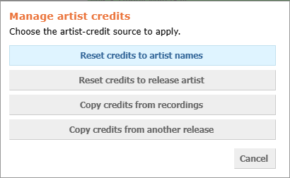
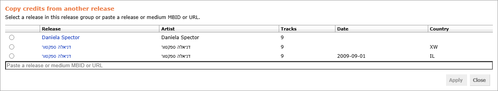

# Release Artist Toolkit

[![install][badge-install]](https://github.com/dvirtz/musicbrainz-scripts/releases/latest/download/release-artist-toolkit.user.js) [![beta][badge-beta]](https://github.com/dvirtz/musicbrainz-scripts/releases/download/beta-latest/release-artist-toolkit.user.js)
[![source][badge-source]](src/index.ts)

Toolkit for efficiently managing release editor artist credits. Provides batch operations to reset and copy artist credits across tracks, with options for canonical names, recording credits, or another release's credits.

## Features

- **Change all artists default**: Pre-checks the "Change all artists" option to propagate edits across all tracks
- **Change partially matching credits**: Propagates edited artist names by artist ID, even when full credits are not identical
- **Artist credit actions**: Quick dialogs to reset or copy artist credits in bulk:
  - Reset to artist names (canonical)
  - Reset to release artist (uniform)
  - Copy from recordings (per-track source)
  - Copy from another release (with MusicBrainz ID or URL)
- **Copy from Release Group**: Copy release group artist credit to individual track credits
- **Session-only settings**: Alt-click either checkbox to change it for the current page only, without saving it

### Manage Artist Credits Dialog

Quick-access menu for all artist credit operations:

### Copy from Another Release Dialog

Import track credits from a different release in the same release group or by providing a release/medium ID:

## Usage

1. Open a release edit page.
2. In the "Release artist toolkit" box:
   - Enable **"Change all artists default"** to pre-check the release-wide propagation option
   - Enable **"Change partially matching credits"** to match artists by ID across different credit structures
   - Both checkboxes are saved and restored on the next page load. Alt-click one instead to apply it
     to the current page only; an asterisk appears next to it and the saved value is left untouched,
     so reloading the page restores it
3. Click **"Manage artist credits"** to access bulk operations:
   - **Reset credits to artist names**: Restore canonical artist names on both release and tracks
   - **Reset credits to release artist**: Apply the release-level artist credit to every track
   - **Copy credits from recordings**: Use each recording's artist credit for its track
   - **Copy credits from another release**: Select a release or medium (from this release group or by ID/URL) and match credits by position
4. In the release artist credit bubble, click **"Copy from RG"** to copy the release group credit

### Copy Source Formats

For "Copy credits from another release," accept any of:

- Release MBID: `29fef51a-6c85-4f4d-8274-9fd342fe0a24`
- MusicBrainz URL: `https://musicbrainz.org/release/29fef51a-6c85-4f4d-8274-9fd342fe0a24`
- Medium URL: `https://musicbrainz.org/release/29fef51a-6c85-4f4d-8274-9fd342fe0a24/disc/1`
- Disc URL: `https://musicbrainz.org/release/29fef51a-6c85-4f4d-8274-9fd342fe0a24/disc/1`
- Or select a release from the same release group in the dialog

## How It Works

All operations record an edit note with the action performed:

- Reset actions note the type of reset applied
- Copy actions note the source release URL for traceability

Track artist credits are auto-matched by position; if a source medium and target release have the same track count, credits are applied automatically. Otherwise, you can choose which target medium to apply them to.

## Release Notes

See [CHANGELOG.md](CHANGELOG.md).

[badge-install]: https://img.shields.io/badge/install-latest-3c9a40?style=for-the-badge&logo=data%3Aimage%2Fsvg%2Bxml%3Bbase64%2CPHN2ZyB4bWxucz0iaHR0cDovL3d3dy53My5vcmcvMjAwMC9zdmciIHhtbG5zOnhsaW5rPSJodHRwOi8vd3d3LnczLm9yZy8xOTk5L3hsaW5rIiB2ZXJzaW9uPSIxLjEiIGlkPSJDYXBhXzEiIHg9IjBweCIgeT0iMHB4IiB2aWV3Qm94PSIwIDAgMjkuOTc4IDI5Ljk3OCIgc3R5bGU9ImN1cnNvcjogZGVmYXVsdDsiIHhtbDpzcGFjZT0icHJlc2VydmUiPiA8Zz4gPHBhdGggc3R5bGU9ImZpbGw6IzNDOUE0MDsiIGQ9Ik0yNS40NjIsMTkuMTA1djYuODQ4SDQuNTE1di02Ljg0OEgwLjQ4OXY4Ljg2MWMwLDEuMTExLDAuOSwyLjAxMiwyLjAxNiwyLjAxMmgyNC45NjdjMS4xMTUsMCwyLjAxNi0wLjksMi4wMTYtMi4wMTIgICB2LTguODYxSDI1LjQ2MnoiLz4gPHBhdGggc3R5bGU9ImZpbGw6IzNDOUE0MDsiIGQ9Ik0xNC42MiwxOC40MjZsLTUuNzY0LTYuOTY1YzAsMC0wLjg3Ny0wLjgyOCwwLjA3NC0wLjgyOHMzLjI0OCwwLDMuMjQ4LDBzMC0wLjU1NywwLTEuNDE2YzAtMi40NDksMC02LjkwNiwwLTguNzIzICAgYzAsMC0wLjEyOS0wLjQ5NCwwLjYxNS0wLjQ5NGMwLjc1LDAsNC4wMzUsMCw0LjU3MiwwYzAuNTM2LDAsMC41MjQsMC40MTYsMC41MjQsMC40MTZjMCwxLjc2MiwwLDYuMzczLDAsOC43NDIgICBjMCwwLjc2OCwwLDEuMjY2LDAsMS4yNjZzMS44NDIsMCwyLjk5OCwwYzEuMTU0LDAsMC4yODUsMC44NjcsMC4yODUsMC44NjdzLTQuOTA0LDYuNTEtNS41ODgsNy4xOTMgICBDMTUuMDkyLDE4Ljk3OSwxNC42MiwxOC40MjYsMTQuNjIsMTguNDI2eiIvPiA8Zz4gPC9nPiA8Zz4gPC9nPiA8Zz4gPC9nPiA8Zz4gPC9nPiA8Zz4gPC9nPiA8Zz4gPC9nPiA8Zz4gPC9nPiA8Zz4gPC9nPiA8Zz4gPC9nPiA8Zz4gPC9nPiA8Zz4gPC9nPiA8Zz4gPC9nPiA8Zz4gPC9nPiA8Zz4gPC9nPiA8Zz4gPC9nPiA8L2c%2BIDxnPiA8L2c%2BIDxnPiA8L2c%2BIDxnPiA8L2c%2BIDxnPiA8L2c%2BIDxnPiA8L2c%2BIDxnPiA8L2c%2BIDxnPiA8L2c%2BIDxnPiA8L2c%2BIDxnPiA8L2c%2BIDxnPiA8L2c%2BIDxnPiA8L2c%2BIDxnPiA8L2c%2BIDxnPiA8L2c%2BIDxnPiA8L2c%2BIDxnPiA8L2c%2BIDwvc3ZnPg%3D%3D&labelColor=lightyellow
[badge-beta]: https://img.shields.io/badge/install-beta-d83a3a?style=for-the-badge&logo=data%3Aimage%2Fsvg%2Bxml%3Bbase64%2CPHN2ZyB4bWxucz0iaHR0cDovL3d3dy53My5vcmcvMjAwMC9zdmciIHhtbG5zOnhsaW5rPSJodHRwOi8vd3d3LnczLm9yZy8xOTk5L3hsaW5rIiB2ZXJzaW9uPSIxLjEiIGlkPSJDYXBhXzEiIHg9IjBweCIgeT0iMHB4IiB2aWV3Qm94PSIwIDAgMjkuOTc4IDI5Ljk3OCIgc3R5bGU9ImN1cnNvcjogZGVmYXVsdDsiIHhtbDpzcGFjZT0icHJlc2VydmUiPiA8Zz4gPHBhdGggc3R5bGU9ImZpbGw6IzNDOUE0MDsiIGQ9Ik0yNS40NjIsMTkuMTA1djYuODQ4SDQuNTE1di02Ljg0OEgwLjQ4OXY4Ljg2MWMwLDEuMTExLDAuOSwyLjAxMiwyLjAxNiwyLjAxMmgyNC45NjdjMS4xMTUsMCwyLjAxNi0wLjksMi4wMTYtMi4wMTIgICB2LTguODYxSDI1LjQ2MnoiLz4gPHBhdGggc3R5bGU9ImZpbGw6IzNDOUE0MDsiIGQ9Ik0xNC42MiwxOC40MjZsLTUuNzY0LTYuOTY1YzAsMC0wLjg3Ny0wLjgyOCwwLjA3NC0wLjgyOHMzLjI0OCwwLDMuMjQ4LDBzMC0wLjU1NywwLTEuNDE2YzAtMi40NDksMC02LjkwNiwwLTguNzIzICAgYzAsMC0wLjEyOS0wLjQ5NCwwLjYxNS0wLjQ5NGMwLjc1LDAsNC4wMzUsMCw0LjU3MiwwYzAuNTM2LDAsMC41MjQsMC40MTYsMC41MjQsMC40MTZjMCwxLjc2MiwwLDYuMzczLDAsOC43NDIgICBjMCwwLjc2OCwwLDEuMjY2LDAsMS4yNjZzMS44NDIsMCwyLjk5OCwwYzEuMTU0LDAsMC4yODUsMC44NjcsMC4yODUsMC44NjdzLTQuOTA0LDYuNTEtNS41ODgsNy4xOTMgICBDMTUuMDkyLDE4Ljk3OSwxNC42MiwxOC40MjYsMTQuNjIsMTguNDI2eiIvPiA8Zz4gPC9nPiA8Zz4gPC9nPiA8Zz4gPC9nPiA8Zz4gPC9nPiA8Zz4gPC9nPiA8Zz4gPC9nPiA8Zz4gPC9nPiA8Zz4gPC9nPiA8Zz4gPC9nPiA8Zz4gPC9nPiA8Zz4gPC9nPiA8Zz4gPC9nPiA8Zz4gPC9nPiA8Zz4gPC9nPiA8Zz4gPC9nPiA8L2c%2BIDxnPiA8L2c%2BIDxnPiA8L2c%2BIDxnPiA8L2c%2BIDxnPiA8L2c%2BIDxnPiA8L2c%2BIDxnPiA8L2c%2BIDxnPiA8L2c%2BIDxnPiA8L2c%2BIDxnPiA8L2c%2BIDxnPiA8L2c%2BIDxnPiA8L2c%2BIDxnPiA8L2c%2BIDxnPiA8L2c%2BIDxnPiA8L2c%2BIDxnPiA8L2c%2BIDwvc3ZnPg%3D%3D&labelColor=lightyellow
[badge-source]: https://img.shields.io/badge/source-lightyellow?style=for-the-badge&logo=data%3Aimage%2Fsvg%2Bxml%3Bbase64%2CPHN2ZyB4bWxucz0iaHR0cDovL3d3dy53My5vcmcvMjAwMC9zdmciIHhtbG5zOnhsaW5rPSJodHRwOi8vd3d3LnczLm9yZy8xOTk5L3hsaW5rIiB2ZXJzaW9uPSIxLjEiIHg9IjBweCIgeT0iMHB4IiB2aWV3Qm94PSIwIDAgMTAwIDEwMCIgZW5hYmxlLWJhY2tncm91bmQ9Im5ldyAwIDAgMTAwIDEwMCIgeG1sOnNwYWNlPSJwcmVzZXJ2ZSIgc3R5bGU9ImN1cnNvcjogZGVmYXVsdDsiPjxwYXRoIHN0eWxlPSJmaWxsOiMzODM4OEE7IiBkPSJNMi4zNDMsNTQuMUMwLjkzOCw1My4xNjIsMCw1MS4yODksMCw0OS42NDhjMC0xLjY0LDAuNzAzLTMuMTYyLDIuNDYtMy45ODJIMi4zNDNjOC4zMTctNC45MiwxOS45MTUtMTEuNDgsMjcuNjQ3LTE2LjA0OSAgdjEwLjg5NWMtMy4wNDYsMS43NTctNy4xNDYsMy43NDktMTcuNDU1LDkuMjU1bDAuMTE3LDAuMTE2YzUuNTA2LDIuNDYxLDExLjgzMiw2LjIwOSwxNy4zMzgsOS40ODl2MTEuMDEyTDIuMzQzLDU0LjF6Ii8%2BPHBhdGggc3R5bGU9ImZpbGw6IzM4Mzg4QTsiIGQ9Ik05Ny42NTcsNDUuOWMxLjQwNCwwLjkzOCwyLjM0MywyLjgxMiwyLjM0Myw0LjQ1MmMwLDEuNjQtMC43MDMsMy4xNjItMi40NjEsMy45ODJoMC4xMTggIGMtOC4zMTcsNC45Mi0xOS45MTYsMTEuNDgtMjcuNjQ3LDE2LjA0OVY1OS40ODhjMy4wNDYtMS43NTYsNy4xNDYtMy43NDgsMTcuNDU1LTkuMjU0bC0wLjExNy0wLjExNiAgYy01LjUwNS0yLjQ2MS0xMS44MzItNi4yMDktMTcuMzM4LTkuNDg5VjI5LjYxN0w5Ny42NTcsNDUuOXoiLz48cGF0aCBzdHlsZT0iZmlsbDojMzgzODhBOyIgZD0iTTQ2LjQwMSw3MS44NDRIMzkuMzlMNTMuNDgsMjguMTU2aDcuMTNMNDYuNDAxLDcxLjg0NHoiLz48L3N2Zz4%3D
