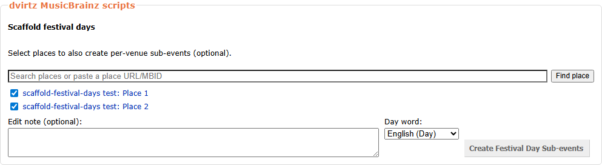
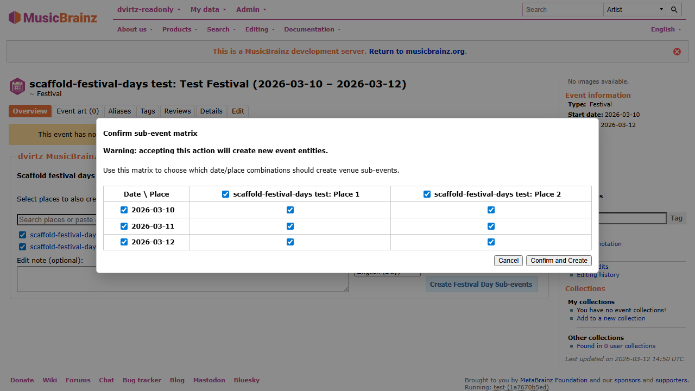
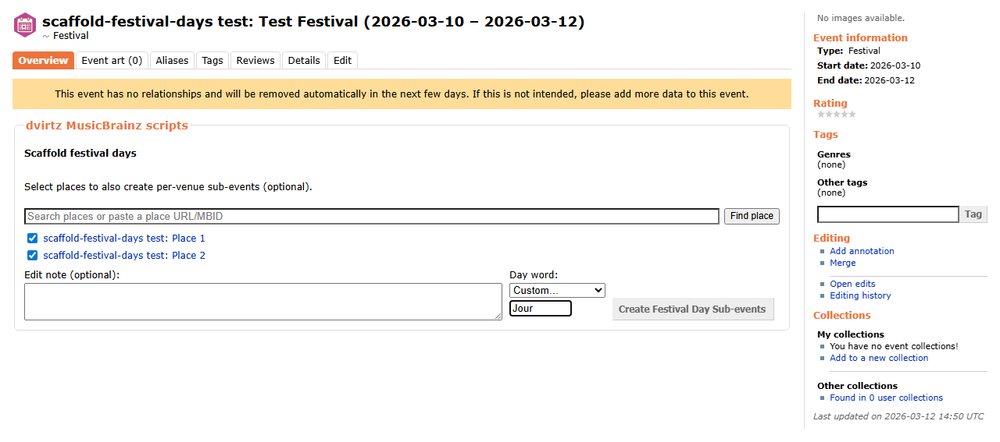

# Scaffold festival days

[![install][badge-install]](https://github.com/dvirtz/musicbrainz-scripts/releases/latest/download/scaffold-festival-days.user.js) [![beta][badge-beta]](https://github.com/dvirtz/musicbrainz-scripts/releases/download/beta-latest/scaffold-festival-days.user.js) [![source][badge-source]](src/index.ts)

Create festival daily sub-events

According to MusicBrainz [guidelines](https://musicbrainz.org/doc/Style/Event#Multi-day_and_multi-stage_events), a `Festival` event spanning multiple days should have child events for each day. If the festival takes place at multiple venues, each day/venue combination should have its own child event. Single-day festivals can still use this tool to scaffold direct per-place stage events.

This userscript adds a toolbox to eligible festival event pages and scaffolds:

- day sub-events (one per festival date)
- optional venue sub-events (per selected day/place combination)
- direct per-place sub-events for single-day festivals

## When the Tool Appears

The toolbox is shown only when all of these are true:

- you are logged in
- the event type is `Festival`
- the event has valid begin/end dates
- the event does not already have child event parts

## Full Workflow

1. Open a qualifying Festival event page.
2. Review linked places (if any) and uncheck any places you do not want to use.
3. Optionally add more places:

- paste a place URL/MBID and click `Find place`, or
- search by text and click `Add` on a result.

1. Choose the day term:

- pick one of the language presets, or
- select `Custom…` and enter your own term.

1. Click `Create Festival Day Sub-events`.
2. In the confirmation matrix, choose exactly which day/place combinations should create venue sub-events.
3. Click `Confirm and Create`.
4. When creation finishes, optionally refresh to see new sub-events.

For single-day festivals, the toolbox skips the day-term selector and creates direct per-place child events instead.

## Day Term Selection

Selecting `Custom…` reveals an input field:

The selected day term is saved in userscript storage and reused the next time you run the script.

## Naming Convention

Generated names use the selected day term:

- Day event: `Festival Name, <day-term> <day-number>`
- Venue event: `Festival Name, <day-term> <day-number>: <place-name>`
- Single-day place event: `Festival Name: <place-name>`

Examples:

- `Festival Name, Day 1`
- `Festival Name, Jour 1`
- `Festival Name, Dag 1: Main Stage`
- `Festival Name: Main Stage`

## Notes

- If no places are selected, only day sub-events are created.
- Single-day festivals require at least one selected place.
- Status messages in the toolbox show progress and any failure point.
- The script submits event creation and relationship edits through MusicBrainz edit endpoints.

## Release Notes

See [CHANGELOG.md](CHANGELOG.md).

[badge-install]: https://img.shields.io/badge/install-latest-3c9a40?style=for-the-badge&logo=data%3Aimage%2Fsvg%2Bxml%3Bbase64%2CPHN2ZyB4bWxucz0iaHR0cDovL3d3dy53My5vcmcvMjAwMC9zdmciIHhtbG5zOnhsaW5rPSJodHRwOi8vd3d3LnczLm9yZy8xOTk5L3hsaW5rIiB2ZXJzaW9uPSIxLjEiIGlkPSJDYXBhXzEiIHg9IjBweCIgeT0iMHB4IiB2aWV3Qm94PSIwIDAgMjkuOTc4IDI5Ljk3OCIgc3R5bGU9ImN1cnNvcjogZGVmYXVsdDsiIHhtbDpzcGFjZT0icHJlc2VydmUiPiA8Zz4gPHBhdGggc3R5bGU9ImZpbGw6IzNDOUE0MDsiIGQ9Ik0yNS40NjIsMTkuMTA1djYuODQ4SDQuNTE1di02Ljg0OEgwLjQ4OXY4Ljg2MWMwLDEuMTExLDAuOSwyLjAxMiwyLjAxNiwyLjAxMmgyNC45NjdjMS4xMTUsMCwyLjAxNi0wLjksMi4wMTYtMi4wMTIgICB2LTguODYxSDI1LjQ2MnoiLz4gPHBhdGggc3R5bGU9ImZpbGw6IzNDOUE0MDsiIGQ9Ik0xNC42MiwxOC40MjZsLTUuNzY0LTYuOTY1YzAsMC0wLjg3Ny0wLjgyOCwwLjA3NC0wLjgyOHMzLjI0OCwwLDMuMjQ4LDBzMC0wLjU1NywwLTEuNDE2YzAtMi40NDksMC02LjkwNiwwLTguNzIzICAgYzAsMC0wLjEyOS0wLjQ5NCwwLjYxNS0wLjQ5NGMwLjc1LDAsNC4wMzUsMCw0LjU3MiwwYzAuNTM2LDAsMC41MjQsMC40MTYsMC41MjQsMC40MTZjMCwxLjc2MiwwLDYuMzczLDAsOC43NDIgICBjMCwwLjc2OCwwLDEuMjY2LDAsMS4yNjZzMS44NDIsMCwyLjk5OCwwYzEuMTU0LDAsMC4yODUsMC44NjcsMC4yODUsMC44NjdzLTQuOTA0LDYuNTEtNS41ODgsNy4xOTMgICBDMTUuMDkyLDE4Ljk3OSwxNC42MiwxOC40MjYsMTQuNjIsMTguNDI2eiIvPiA8Zz4gPC9nPiA8Zz4gPC9nPiA8Zz4gPC9nPiA8Zz4gPC9nPiA8Zz4gPC9nPiA8Zz4gPC9nPiA8Zz4gPC9nPiA8Zz4gPC9nPiA8Zz4gPC9nPiA8Zz4gPC9nPiA8Zz4gPC9nPiA8Zz4gPC9nPiA8Zz4gPC9nPiA8Zz4gPC9nPiA8Zz4gPC9nPiA8L2c%2BIDxnPiA8L2c%2BIDxnPiA8L2c%2BIDxnPiA8L2c%2BIDxnPiA8L2c%2BIDxnPiA8L2c%2BIDxnPiA8L2c%2BIDxnPiA8L2c%2BIDxnPiA8L2c%2BIDxnPiA8L2c%2BIDxnPiA8L2c%2BIDxnPiA8L2c%2BIDxnPiA8L2c%2BIDxnPiA8L2c%2BIDxnPiA8L2c%2BIDxnPiA8L2c%2BIDwvc3ZnPg%3D%3D&labelColor=lightyellow
[badge-beta]: https://img.shields.io/badge/install-beta-d83a3a?style=for-the-badge&logo=data%3Aimage%2Fsvg%2Bxml%3Bbase64%2CPHN2ZyB4bWxucz0iaHR0cDovL3d3dy53My5vcmcvMjAwMC9zdmciIHhtbG5zOnhsaW5rPSJodHRwOi8vd3d3LnczLm9yZy8xOTk5L3hsaW5rIiB2ZXJzaW9uPSIxLjEiIGlkPSJDYXBhXzEiIHg9IjBweCIgeT0iMHB4IiB2aWV3Qm94PSIwIDAgMjkuOTc4IDI5Ljk3OCIgc3R5bGU9ImN1cnNvcjogZGVmYXVsdDsiIHhtbDpzcGFjZT0icHJlc2VydmUiPiA8Zz4gPHBhdGggc3R5bGU9ImZpbGw6IzNDOUE0MDsiIGQ9Ik0yNS40NjIsMTkuMTA1djYuODQ4SDQuNTE1di02Ljg0OEgwLjQ4OXY4Ljg2MWMwLDEuMTExLDAuOSwyLjAxMiwyLjAxNiwyLjAxMmgyNC45NjdjMS4xMTUsMCwyLjAxNi0wLjksMi4wMTYtMi4wMTIgICB2LTguODYxSDI1LjQ2MnoiLz4gPHBhdGggc3R5bGU9ImZpbGw6IzNDOUE0MDsiIGQ9Ik0xNC42MiwxOC40MjZsLTUuNzY0LTYuOTY1YzAsMC0wLjg3Ny0wLjgyOCwwLjA3NC0wLjgyOHMzLjI0OCwwLDMuMjQ4LDBzMC0wLjU1NywwLTEuNDE2YzAtMi40NDksMC02LjkwNiwwLTguNzIzICAgYzAsMC0wLjEyOS0wLjQ5NCwwLjYxNS0wLjQ5NGMwLjc1LDAsNC4wMzUsMCw0LjU3MiwwYzAuNTM2LDAsMC41MjQsMC40MTYsMC41MjQsMC40MTZjMCwxLjc2MiwwLDYuMzczLDAsOC43NDIgICBjMCwwLjc2OCwwLDEuMjY2LDAsMS4yNjZzMS44NDIsMCwyLjk5OCwwYzEuMTU0LDAsMC4yODUsMC44NjcsMC4yODUsMC44NjdzLTQuOTA0LDYuNTEtNS41ODgsNy4xOTMgICBDMTUuMDkyLDE4Ljk3OSwxNC42MiwxOC40MjYsMTQuNjIsMTguNDI2eiIvPiA8Zz4gPC9nPiA8Zz4gPC9nPiA8Zz4gPC9nPiA8Zz4gPC9nPiA8Zz4gPC9nPiA8Zz4gPC9nPiA8Zz4gPC9nPiA8Zz4gPC9nPiA8Zz4gPC9nPiA8Zz4gPC9nPiA8Zz4gPC9nPiA8Zz4gPC9nPiA8Zz4gPC9nPiA8Zz4gPC9nPiA8Zz4gPC9nPiA8L2c%2BIDxnPiA8L2c%2BIDxnPiA8L2c%2BIDxnPiA8L2c%2BIDxnPiA8L2c%2BIDxnPiA8L2c%2BIDxnPiA8L2c%2BIDxnPiA8L2c%2BIDxnPiA8L2c%2BIDxnPiA8L2c%2BIDxnPiA8L2c%2BIDxnPiA8L2c%2BIDxnPiA8L2c%2BIDxnPiA8L2c%2BIDxnPiA8L2c%2BIDxnPiA8L2c%2BIDwvc3ZnPg%3D%3D&labelColor=lightyellow
[badge-source]: https://img.shields.io/badge/source-lightyellow?style=for-the-badge&logo=data%3Aimage%2Fsvg%2Bxml%3Bbase64%2CPHN2ZyB4bWxucz0iaHR0cDovL3d3dy53My5vcmcvMjAwMC9zdmciIHhtbG5zOnhsaW5rPSJodHRwOi8vd3d3LnczLm9yZy8xOTk5L3hsaW5rIiB2ZXJzaW9uPSIxLjEiIHg9IjBweCIgeT0iMHB4IiB2aWV3Qm94PSIwIDAgMTAwIDEwMCIgZW5hYmxlLWJhY2tncm91bmQ9Im5ldyAwIDAgMTAwIDEwMCIgeG1sOnNwYWNlPSJwcmVzZXJ2ZSIgc3R5bGU9ImN1cnNvcjogZGVmYXVsdDsiPjxwYXRoIHN0eWxlPSJmaWxsOiMzODM4OEE7IiBkPSJNMi4zNDMsNTQuMUMwLjkzOCw1My4xNjIsMCw1MS4yODksMCw0OS42NDhjMC0xLjY0LDAuNzAzLTMuMTYyLDIuNDYtMy45ODJIMi4zNDNjOC4zMTctNC45MiwxOS45MTUtMTEuNDgsMjcuNjQ3LTE2LjA0OSAgdjEwLjg5NWMtMy4wNDYsMS43NTctNy4xNDYsMy43NDktMTcuNDU1LDkuMjU1bDAuMTE3LDAuMTE2YzUuNTA2LDIuNDYxLDExLjgzMiw2LjIwOSwxNy4zMzgsOS40ODl2MTEuMDEyTDIuMzQzLDU0LjF6Ii8%2BPHBhdGggc3R5bGU9ImZpbGw6IzM4Mzg4QTsiIGQ9Ik05Ny42NTcsNDUuOWMxLjQwNCwwLjkzOCwyLjM0MywyLjgxMiwyLjM0Myw0LjQ1MmMwLDEuNjQtMC43MDMsMy4xNjItMi40NjEsMy45ODJoMC4xMTggIGMtOC4zMTcsNC45Mi0xOS45MTYsMTEuNDgtMjcuNjQ3LDE2LjA0OVY1OS40ODhjMy4wNDYtMS43NTYsNy4xNDYtMy43NDgsMTcuNDU1LTkuMjU0bC0wLjExNy0wLjExNiAgYy01LjUwNS0yLjQ2MS0xMS44MzItNi4yMDktMTcuMzM4LTkuNDg5VjI5LjYxN0w5Ny42NTcsNDUuOXoiLz48cGF0aCBzdHlsZT0iZmlsbDojMzgzODhBOyIgZD0iTTQ2LjQwMSw3MS44NDRIMzkuMzlMNTMuNDgsMjguMTU2aDcuMTNMNDYuNDAxLDcxLjg0NHoiLz48L3N2Zz4%3D
